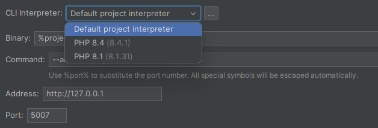

    

<h1 align="center">Buggregator IDEA Plugin</h1>

 

The plugin integrates Buggregator into the JetBrains IDEs, allowing you to debug your code with ease.  
Now you don't need to switch to another window or screen to look at dumps and then back to run tests.
Everything is in front of you, and all the shortcuts work.

## Installation

### Marketplace

Go to the [Plugin homepage in the JetBrains Marketplace](https://plugins.jetbrains.com/plugin/26344-buggregator) and click the <kbd>Install to ...</kbd> button.

### IDE built-in plugin system

To install the plugin from the IDE built-in plugin system, go to IDEA <kbd>Settings</kbd> > <kbd>Plugins</kbd> > <kbd>Marketplace</kbd> > 🔍 Search for "Buggregator" > click <kbd>Install</kbd>.

### Manual installation

1. Download the latest release from the [Releases page](https://github.com/buggregator/phpstorm-plugin/releases) or from the [JetBrains Marketplace](https://plugins.jetbrains.com/plugin/26344-buggregator/versions).
2. Go to IDEA <kbd>Settings</kbd> > <kbd>Plugins</kbd> > <kbd>⚙️</kbd> > <kbd>Install plugin from disk...</kbd>
3. Select the downloaded `.jar` file and click <kbd>OK</kbd>.

> [!IMPORTANT]
> The IDE might ask you to restart it to apply the changes. After that, you can find the Buggregator button in the top right corner of the IDE window.

## Overview

### How it works:

By default, when started, the plugin tries to run Trap from the vendor folder using the PHP interpreter set in the project settings.
The parameters specified in the plugin settings are passed to Trap.

> [!NOTE]
> Therefore:
> - You need to have [`buggregator/trap`](https://github.com/buggregator/trap) installed in your project.
> - You can change the PHP interpreter in the plugin settings if needed.
> - You can change the path to Trap in the plugin settings.

The plugin provides two channels for receiving information from Trap as separate tabs:
- Web UI — an interactive Buggregator interface that opens in the IDE's built-in browser.
- Terminal — displays information in text form.

Trap opens the Web interface port specified in the settings, which works well with many clients.
Click the <kbd>🌐</kbd> button on the toolbar to open the Web UI in the system browser.

If you use the plugin in multiple running IDEs with the same port settings, both Web UIs will work with the same Trap.
Another Trap instance will wait for the port to be free.

## Future scope

Currently, the plugin only works for launching [Buggregator Trap](https://github.com/buggregator/trap) from the vendor directory (or any other), but we are working on making it compatible with the [Buggregator server application](https://github.com/buggregator/server) as well.

