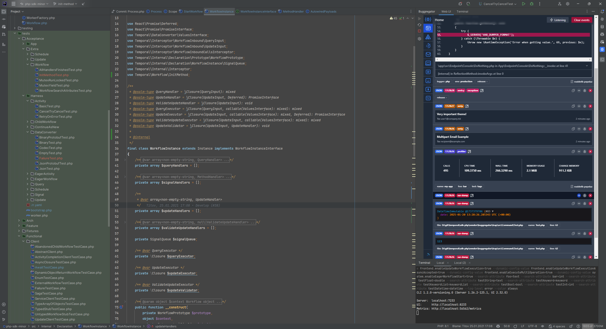

<h1 align="center">Buggregator IDEA Plugin</h1>

The plugin integrates Buggregator into the JetBrains IDEs, allowing you to debug your code with ease.  
Now you don't need to switch to another window or screen to look at dumps and then back to run tests.
Everything is in front of you, and all the shortcuts work.

## Get started

Go to the [Plugin homepage in the JetBrains Marketplace](https://plugins.jetbrains.com/plugin/26344-buggregator) and click the "Install" button.

To install the plugin from the IDE, go to IDEA settings → Plugins → Marketplace → Search for "Buggregator" → click "Install".

The IDE might ask you to restart it to apply the changes. After that, you can find the Buggregator button in the top right corner of the IDE window.

Currently, the plugin only works for launching [Buggregator Trap](https://github.com/buggregator/trap) from the vendor directory (or any other), but we are working on making it compatible with the [Buggregator server application](https://github.com/buggregator/server) as well.

